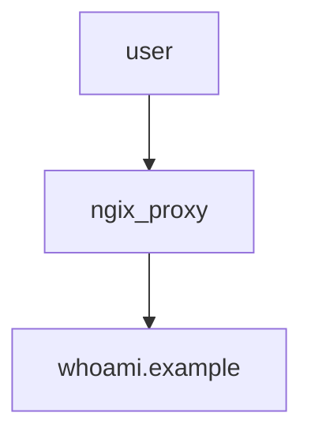

# nginx-proxy



### proxy up
- https://docs.docker.com/compose/features-uses/
```bash
$ docker compose -f compose.yml up -d
[+] Running 2/2
 ✔ Container auto-reverse-proxy-nginx-proxy-1  Started                                                                                                                                                                    0.0s 
 ✔ Container auto-reverse-proxy-whoami-1       Started 

$ docker compose -f compose.yml ps
NAME                               IMAGE                    COMMAND                                       SERVICE       CREATED         STATUS              PORTS
auto-reverse-proxy-nginx-proxy-1   nginxproxy/nginx-proxy   "/app/docker-entrypoint.sh forego start -r"   nginx-proxy   8 minutes ago   Up About a minute   0.0.0.0:8949->80/tcp, :::8949->80/tcp
auto-reverse-proxy-whoami-1        jwilder/whoami           "/app/http"                                   whoami        9 minutes ago   Up About a minute   8000/tcp

$ docker compose -f compose.yml images
CONTAINER                          REPOSITORY               TAG                 IMAGE ID            SIZE
auto-reverse-proxy-nginx-proxy-1   nginxproxy/nginx-proxy   latest              f0ee028e9dcd        203MB
auto-reverse-proxy-whoami-1        jwilder/whoami           latest              89be8564e650        10.1MB
```

### proxy stop/start/down/images
```bash
$ docker compose -f compose.yml stop
[+] Stopping 2/2
 ✔ Container auto-reverse-proxy-whoami-1       Stopped  0.4s 
 ✔ Container auto-reverse-proxy-nginx-proxy-1  Stopped

$ docker compose -f compose.yml ps -a
NAME                               IMAGE                    COMMAND                                       SERVICE       CREATED          STATUS                      PORTS
auto-reverse-proxy-nginx-proxy-1   nginxproxy/nginx-proxy   "/app/docker-entrypoint.sh forego start -r"   nginx-proxy   14 minutes ago   Exited (2) 26 seconds ago
auto-reverse-proxy-whoami-1        jwilder/whoami           "/app/http"                                   whoami        15 minutes ago   Exited (2) 26 seconds ag

$ docker compose -f compose.yml start

# https://docs.docker.com/engine/reference/commandline/compose_down/
# Stop and remove containers, networks
$ docker compose -f compose.yml down
```

### Testing with command line
```bash
$ curl -H "Host: whoami.example" localhost
I'm ff9bf2c3bb14
```

### Testing with Chrome Browser in Windows
1. Modifying to hosts file(c:\Windows\System32\drivers\etc\hosts) administrator privileges
    ```bash
    # dj26
    127.0.0.1	whoami.example
    ```

2. Open whoami.example in your browser

    

### docker stats
- Display a live stream of container(s) resource usage statistics
- https://docs.docker.com/engine/reference/commandline/stats/
```bash
$ docker stats --no-stream
CONTAINER ID   NAME                               CPU %     MEM USAGE / LIMIT     MEM %     NET I/O           BLOCK I/O   PIDS
ff9bf2c3bb14   aaingyuniigithubio-whoami-1        0.00%     1.469MiB / 2.844GiB   0.05%     3.92kB / 1.56kB   0B / 0B     5
3ca0bc62712e   aaingyuniigithubio-nginx-proxy-1   0.29%     49.49MiB / 2.844GiB   1.70%     5.02kB / 4.01kB   0B / 0B     29
```

